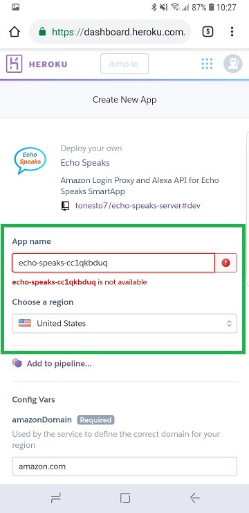
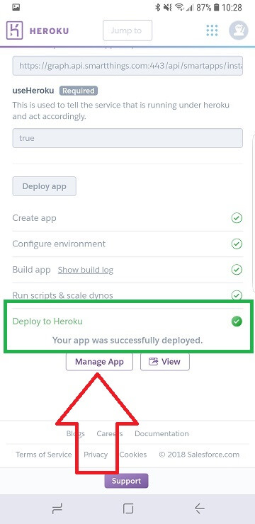
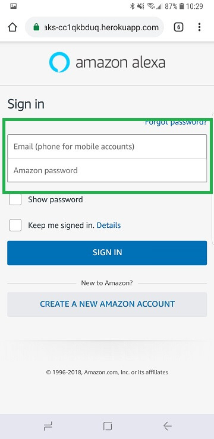
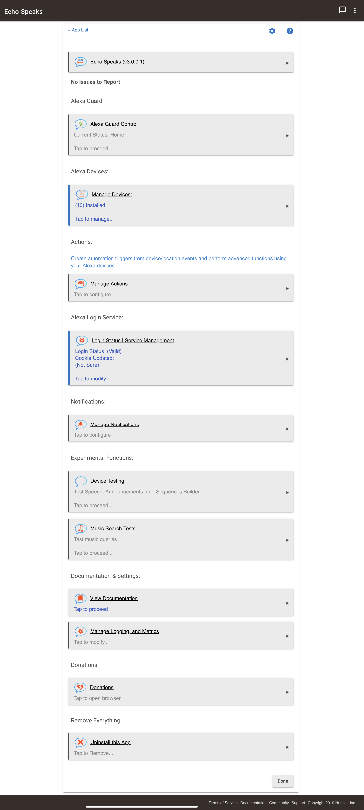
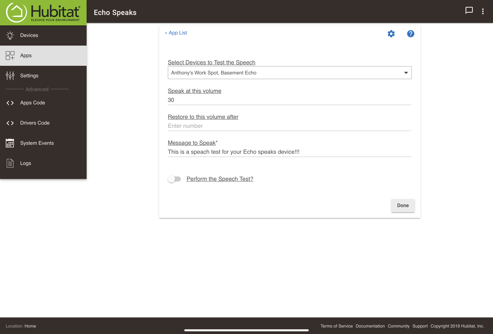

### <h3 class="doc-head">Step 1:</h3>
You will be returned to the Server config page.

* Verify Amazon region settings are correct (pink box).
* Then tap on the **Begin Heroku Setup** shown in the green box below.

    

---
### <h3 class="doc-head">Step 2:</h3>

* A browser window should open that looks like the one below.
* Highlight and copy the information in the gray box for later use.

    

Now tap on the **Deploy to Heroku** button.

  

---
### <h3 class="doc-head">Step 3:</h3>

You will paste the information from the previous step into the box named **App Name**

See the green box below.
Your information is going to show that the app name is not available.

***YOU MUST FOLLOW THE NEXT STEP EXACTLY AS WRITTEN***

---
### <h3 class="doc-head">Step 4:</h3>

 **THIS MUST BE DONE PRECISELY.  FAILURE TO FOLLOW THIS STEP MAY RESULT IN YOUR APP NOT OPERATING PROPERLY**

 * Please tap on the app name you pasted to open your keyboard on your screen, and then tap the space bar.
 * Now tap the back button to delete that space that you just typed in.
 * You **MUST** remove the space.
 * Once the space is removed it should now turn green as pictured below:

    

---
### <h3 class="doc-head">Step 5:</h3>
Scroll to the bottom of the screen and tap on the **Deploy App** button. You will now see the information below as the app is being deployed. 
***Think of the below picture as a movie.... the words will change***

---
### <h3 class="doc-head">Step 6:</h3>
Once the screen looks like the one below (It generally only takes a minute or two after starting the above).

* Tap on the **View** button.

    

* That will open this page shown below.

    

---
### <h3 class="doc-head">Step 7:</h3>
At this point, you need to get your amazon login cookie:

* Tap on the **Go to Login Page** button as shown below.

    

---
### <h3 class="doc-head">Step 8:</h3>
Input your CORRECT login information for the Amazon account that your devices are registered with, then tap on 'Sign In'.

When the above part is done successfully, you will see the screen below.

---
### <h3 class="doc-head">Step 9:</h3>
At this point, close the browser window and go back into the Hubitat web interface.

* Open the Echo Speaks App and press **Save** then wait a couple of minutes.

    

* Your app needs to communicate with Amazon and this can sometimes take about 1 minute.

    So after waiting for about 1 minute you can open the Echo Speaks App and you should see the Installed Devices section populated.

    

---
### <h3 class="doc-head">Step 10:</h3>
Once you see your devices scroll down.

* Tap on the **Device Testing**

    

* Tap on the **Speech Test**

    

---
### <h3 class="doc-head">Step 11:</h3>
Select the devices to test and activate the **Perform the Speech Test** toggle.

* This will send a test text to speech command to selected devices.
* If you hear the broadcast on your echo devices, then good.
* If not, sometimes you will need to go into a device under devices and set the volume and try the speech test from there.

---
### <h3 class="doc-head">You're Done!</h3>
Once you have completed these steps you are done.
You can now use the devices in any of your supported Hubitat automations.

***Congratulations!!***
